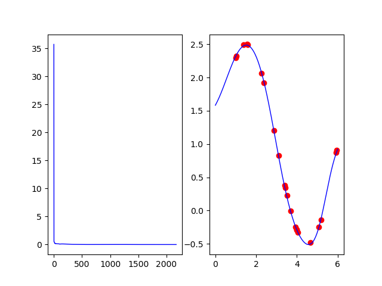

# RedNeuronal
Creando una red neuronal con python solo usando la librería de numpy. 
Esta red neuronal usa los datos del archivo datosSeno.csv que muestra una funcion seno. 
La tarea de la red es aproximar una funcion que se le paresca a los datos de entrada. 
Es una red con dos capas ocultas de 30 y 40 neuronas cada una. 
Aqui una imagen de la grafica que escupe. La primera es una grafica de como fue disminuyendo el error y la otra se compone por los datos de prueba (Puntos rojos) y la respuesta de la red (linea azul) 

